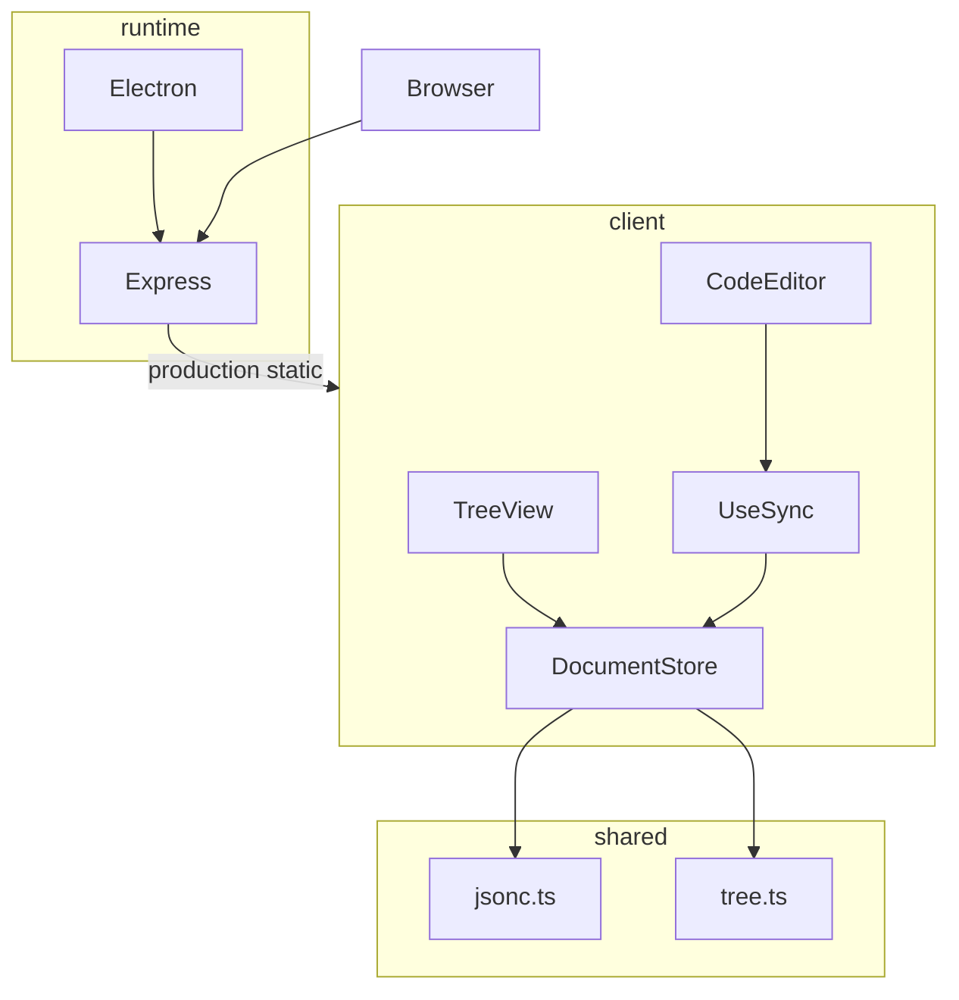
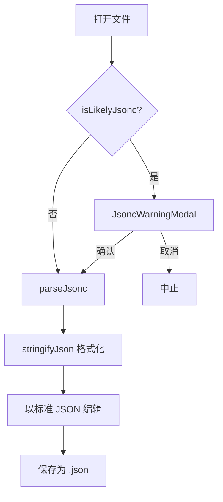

# 架构说明

## Monorepo 结构

```
JSON-Viewer/
├── packages/
│   ├── shared/     # JSONC 解析、树节点转换、公共类型
│   ├── client/     # React SPA（双栏 UI、同步逻辑）
│   ├── server/     # Express API 与静态托管
│   └── electron/   # Electron 主进程、preload、菜单
├── docs/           # 开发文档
└── dist-electron/  # 打包产物（构建后生成）
```

## 模块依赖



## 数据流

### 单一数据源

`DocumentStore` 维护：

| 字段 | 说明 |
|------|------|
| `rawText` | Monaco 中的 JSON 文本 |
| `parsedObject` | 解析后的 JavaScript 对象 |
| `treeNodes` | 树视图节点（由 `objectToTree` 生成） |
| `filePath` | 当前文件路径 |
| `sourceFormat` | `json` 或 `jsonc`（记录来源） |
| `parseError` | 解析错误信息 |

### 代码 → 树

1. 用户在 Monaco 编辑，`onChange` 触发 `handleCodeChange`
2. 立即更新 `rawText`，debounce **300ms** 后调用 `parseJsonc`
3. 解析成功：更新 `parsedObject` 和 `treeNodes`，清除 `parseError`
4. 解析失败：设置 `parseError`，**保留上次有效的** `parsedObject` 和树

### 树 → 代码

1. 用户编辑树节点（增删改）
2. `treeToObject(nodes)` → `stringifyJson` → 更新 `rawText` 和 `parsedObject`
3. 设置 `syncingRef = 'tree'`，Monaco `onChange` 检测后跳过 debounce 解析

### 防循环

```typescript
const syncingRef = useRef<'none' | 'tree' | 'code'>('none');

// 树更新代码前：syncingRef.current = 'tree'
// Monaco onChange：若 syncingRef === 'tree'，重置为 'none' 并 return
```

## JSONC 处理策略



- **检测**：`.jsonc` 扩展名，或内容含 `//`、`/*`、尾逗号
- **警告**：首次打开 JSONC 弹窗确认；可勾选「不再提示」（`localStorage`）
- **剥离**：`parseJsonc` 解析后 `stringifyJson`，注释不保留
- **标记**：状态栏显示「源自 JSONC」

## Electron vs 浏览器

通过 `FileIO` 接口抽象文件操作：

```typescript
interface FileIO {
  open(): Promise<{ content: string; path: string } | null>;
  save(content: string, path?: string | null): Promise<string | null>;
}
```

| 能力 | 浏览器 | Electron |
|------|--------|----------|
| 打开 | `<input type="file">` | `dialog.showOpenDialog` |
| 保存 | Blob 下载 | `dialog.showSaveDialog` + 写磁盘 |
| 菜单 | 无 | 原生菜单 + 快捷键 |

`getFileIO()` 根据 `window.electronAPI` 是否存在自动选择实现。

## 相关文档

- [开发指南](development.md)
- [Electron 打包](electron.md)
- [API 文档](api.md)
